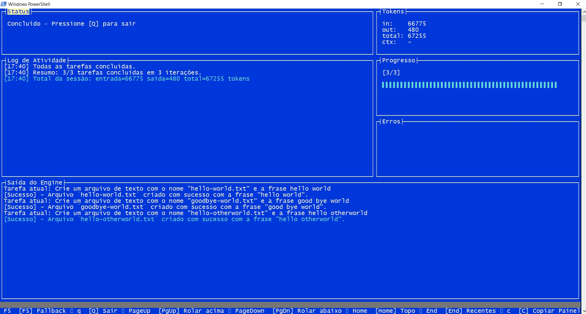

# Ralph CLI

CLI cross-platform (Windows/Linux/macOS) em .NET para executar Ralph Loops com base em tarefas PRD, com foco em automação terminal-first e operação segura em projetos reais.

Repositório oficial: `https://github.com/rodrigojager/ralph`

## Dashboard



Inspirado por:
- `https://github.com/agrimsingh/ralph-wiggum-cursor`
- `https://github.com/michaelshimeles/ralphy`

# O que são Ralph Loops

**Ralph Loops** são um padrão de execução para agentes LLM baseado em três princípios:

1.  **Controle declarativo via arquivo (geralmente `PRD.md`)**
    
2.  **Execução de uma única tarefa por iteração**
    
3.  **Reset completo de contexto entre execuções**
    

O sistema usa o próprio `PRD.md` como **orquestrador de estado**.

---

## PRD como máquina de controle

O `PRD.md` contém uma lista de tarefas com checkboxes:

## Tasks  
  
\- \[ \] Criar interface IUsuarioRepository  
\- \[ \] Implementar UsuarioRepository  
\- \[ \] Criar testes unitários  
\- \[ \] Ajustar DI

Marcadores suportados:

- `- [ ]` tarefa pendente
- `- [x]` tarefa concluída
- `- [~]` tarefa pulada pelo loop e pendente de revisão manual

O funcionamento é:

1.  O loop lê o PRD
    
2.  Identifica a **primeira tarefa não marcada**
    
3.  Executa somente aquela tarefa
    
4.  Se passar nos critérios (build/test)
    
5.  Marca como concluída (`[x]`)
    ou, se a política de `no changes` for ignorada, marca como revisão manual (`[~]`)
    
6.  Encerra o processo
    
7.  Reinicia um novo processo limpo
    
8.  Repete para a próxima tarefa não marcada
    

---

## Fluxo real do Ralph Loop

```pseudo
while (existem tarefas não concluídas):  

    iniciar_processo_limpo()  
  
    ler_PRD()  
    selecionar_primeira_task_nao_marcada()  
  
    executar_apenas_essa_task()  
  
    if (criterios_ok):  
        marcar_checkbox_no_PRD()  
    else:  
        corrigir_ate_passar()  
  
    encerrar_processo()
```

Cada execução resolve **apenas uma task**.

## Contexto lido em cada modo

O Ralph CLI diferencia explicitamente os modos `loop` e `wiggum` na montagem do prompt.

- `loop`:
  lê apenas o contexto comum do PRD, os guardrails e a próxima tarefa pendente.
- `loop`:
  o contexto comum significa tudo que aparece antes da primeira linha de tarefa no `PRD.md`, incluindo quantos blocos, seções, notas e exemplos existirem.
- `loop`:
  ignora tarefas futuras e também ignora tarefas já marcadas com `- [x]` ou `- [~]`.
- `wiggum`:
  lê o corpo completo do PRD em toda tentativa da tarefa ativa, além dos guardrails.

Em termos práticos:

- `loop`:
  `contexto comum do PRD + guardrails + current task`
- `wiggum`:
  `PRD completo + guardrails + active task`

---

## Por que isso é importante?

Esse modelo resolve dois problemas graves de agentes LLM:

### Context Rotting

Nenhum histórico é carregado entre tarefas.

### Escopo inflado

A LLM nunca tenta resolver o PRD inteiro de uma vez.

Ela só vê:

-   A task atual
    
-   O código atual do repositório
    
-   Os critérios objetivos (ex: `dotnet test`)
    

---

## Estado não está na LLM

O estado fica em:

-   `PRD.md`
    
-   Código no filesystem
    
-   Resultados de testes
    
-   Git
    

A LLM é apenas um executor isolado.

---

## Diferença para um agente contínuo

| Agente contínuo | Ralph Loop |
| --- | --- |
| Mantém histórico | Reinicia sempre |
| Pode esquecer decisões antigas | Sempre lê estado real |
| Pode resolver múltiplas tasks juntas | Resolve exatamente uma |
| Alto risco de drift | Baixo risco de drift |

---

## Resumo formal

Um **Ralph Loop** é:

> Um executor iterativo de tarefas declaradas em PRD, que resolve exatamente uma task por execução, marca como concluída, encerra completamente o processo e reinicia sem memória para a próxima.

Ele transforma o `PRD.md` em uma espécie de **fila determinística de trabalho baseada em checkboxes**.

## O que o Ralph CLI faz

- Inicializa workspace `.ralph/` com estado, logs e relatórios.
- Executa tarefas de um `PRD.md` (ou `PRD.yaml`/`PRD.yml`) em loop.
- Suporta execução única (`once`) e execução paralela (`parallel`).
- Integra com múltiplas engines (`cursor`, `claude`, `codex`, `gemini`, etc).
- Pode criar branch/PR por tarefa.
- Tem auto-update (`ralph update`) e sincronização automática de idiomas.
- Oferece múltiplas UIs: `none`, `spectre`, `gum`, `spectre+gum`, `tui`.

## Instalação (usuário final)

### Windows (PowerShell)

```powershell
irm https://raw.githubusercontent.com/rodrigojager/ralph/main/install.ps1 | iex
```

### Linux/macOS

```bash
curl -fsSL https://raw.githubusercontent.com/rodrigojager/ralph/main/install.sh | bash
```

Após instalar:

```bash
ralph --help
ralph --version
```

## Primeiro uso

1. Entre no diretório do seu projeto.
2. Inicialize o workspace:

```bash
ralph init
```

3. Crie seu `PRD.md` com tarefas pendentes (`- [ ] ...`). Se quiser, voce pode utilizar a skill `ralph-loop-prd-generator` disponibilizada em `.skills\ralph-loop-prd-generator` para que seu agente favorito de LLM gere um arquivo já no padrão do Ralph Cli, a partir de user stories.
4. Execute:

```bash
ralph run
```

Execução de tarefa única:

```bash
ralph once "Implementar endpoint /health"
```

## Comandos principais

- `ralph init` inicializa `.ralph/`.
- `ralph run` executa loop completo de tarefas.
- `ralph loop` alias para `run`.
- `ralph run --loop` usa contexto enxuto por tarefa: contexto comum do PRD + guardrails + tarefa atual.
- `ralph run --wiggum` usa contexto completo: PRD inteiro + guardrails + tarefa ativa.
- `ralph run --fast --engine codex --model gpt-5.4` ativa o fast mode do Codex via configuração compatível com o CLI atual.
- `ralph once` executa uma tarefa.
- `ralph parallel` executa tarefas em paralelo.
- `ralph tasks list|next|done|sync` gerencia/sincroniza tarefas.
- `ralph config list|get|set` gerencia configurações.
- `ralph rules list|add|clear` gerencia guardrails.
- `ralph doctor` valida ambiente e engines.
- `ralph logs tail` acompanha logs.
- `ralph report last` exibe último relatório.
- `ralph install [DIR]` instala globalmente e salva preferências.
- `ralph update` atualiza binário e sincroniza idiomas.
- `ralph lang current|list|set|update` gerencia idiomas.
- `ralph ui current|set|toggle` gerencia UI.

Use `ralph --help` para todas as flags atuais.

## Fast mode do Codex

Quando a engine é `codex` e o modelo é compatível com GPT, `--fast` não injeta um argumento legado `codex --fast`.

Em vez disso, o Ralph aplica o fast mode do Codex via configuração:

- `service_tier="fast"`
- `features.fast_mode=true`

Comportamento padrão:

- `codex` + `gpt-*` + `--fast`: ativa fast mode e, se você não sobrescrever manualmente, usa `model_reasoning_effort="low"`.
- `codex` + `gpt-*` sem `--fast`: roda no modo normal e usa `model_reasoning_effort="high"` por padrão.
- outras engines ou modelos não compatíveis: `--fast` é ignorado com aviso, sem quebrar a execução.

Se quiser manter fast mode com um reasoning explícito, passe o override diretamente para a engine:

```bash
ralph run --engine codex --model gpt-5.4 --fast -- --config model_reasoning_effort=\"high\"
```

## Resiliencia operacional

O Ralph agora persiste estado de tarefa em andamento logo no `task_started` e atualiza um heartbeat duravel em `.ralph/heartbeat.json` durante a execucao. Isso melhora tres cenarios operacionais importantes:

- retomada mais confiavel quando o processo morre no meio da tarefa
- deteccao explicita de `unexpected shutdown` no proximo boot
- observabilidade externa por supervisor sem depender apenas de `tmux`

Arquivos relevantes:

- `.ralph/state.json`
- `.ralph/heartbeat.json`
- `.ralph/execution.log`
- `.ralph/reports/latest.md`

Por padrao, `ralph run` supervisiona um worker interno e continua tentando ate o PRD avancar. Se o worker cair sem progresso, o supervisor relanca a execucao e, apos quedas repetidas na mesma tarefa, marca essa tarefa como `[~]` para revisao manual e segue para a proxima. Use `--fail-fast` apenas quando quiser desabilitar esse comportamento resiliente.

## Atualização e idiomas

- `ralph update`:
  - busca a última GitHub Release;
  - atualiza o binário da plataforma;
  - baixa `ralph-lang.zip` e atualiza `lang/*.json` automaticamente.
- `ralph lang update` atualiza somente arquivos de idioma.

## Build e testes (desenvolvimento)

Requer .NET 8 (target `net8.0`).

```bash
dotnet build
dotnet test
```

Publish local:

```bash
dotnet publish src/Ralph.Cli/Ralph.Cli.csproj -c Release -r win-x64 --self-contained
dotnet publish src/Ralph.Cli/Ralph.Cli.csproj -c Release -r linux-x64 --self-contained
dotnet publish src/Ralph.Cli/Ralph.Cli.csproj -c Release -r osx-x64 --self-contained
dotnet publish src/Ralph.Cli/Ralph.Cli.csproj -c Release -r osx-arm64 --self-contained
```
